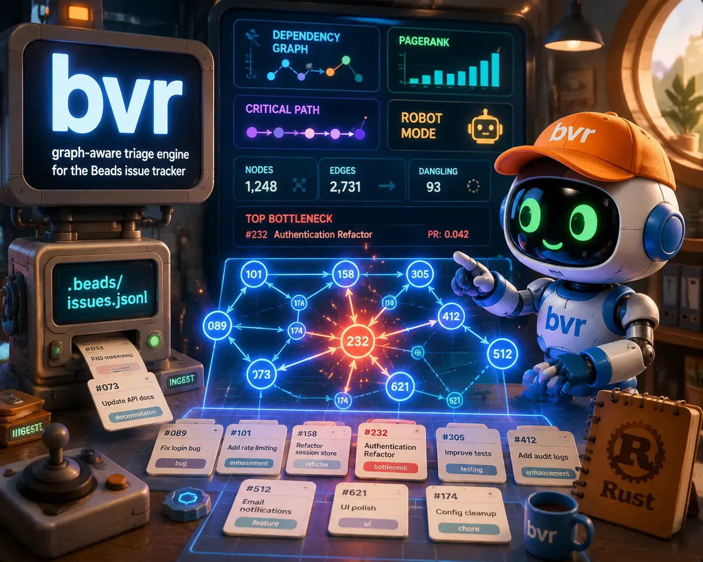

# bvr — Beads Viewer in Rust

<div align="center">
  
</div>

<div align="center">


[](https://github.com/Dicklesworthstone/beads_viewer)

</div>

**The dependency-graph brain for your Beads project — rebuilt in Rust, byte-compatible with the Go original.**

`bvr` is a Compatible Rust Successor of [Dicklesworthstone/beads_viewer](https://github.com/Dicklesworthstone/beads_viewer) (bv): a graph-aware TUI and triage engine for the [Beads](https://github.com/steveyegge/beads) issue tracker. It reads your `.beads/issues.jsonl`, builds the dependency DAG, computes nine graph metrics (PageRank, betweenness, HITS, eigenvector, critical path, cycles, k-core, articulation points, slack), and serves them through an interactive terminal UI and ~41 `--robot-*` JSON commands for AI agents. Same contracts as Go bv; new engine underneath.

<div align="center">

```bash
curl -fsSL "https://raw.githubusercontent.com/OWNER/bv/main/install.sh?$(date +%s)" \
  | bash -s -- --easy-mode
```

</div>

---

## 🤖 Agent Quickstart

⚠️ **Never run bare `bvr`/`bv` in an agent context** — it launches the interactive TUI. Always use `--robot-*`.

```bash
# 1) The mega-command: unified triage with scores, reasons, unblocks
bvr --robot-triage

# 2) Minimal: just the single top pick + claim command
bvr --robot-next

# 3) Dependency-respecting parallel execution tracks
bvr --robot-plan | jq '.plan.tracks[].items[] | {id, unblocks}'

# 4) Full graph metrics with per-metric health flags
bvr --robot-insights | jq '.status'

# 5) Historical point-in-time analysis
bvr --robot-insights --as-of HEAD~30

# 6) Token-optimized output
bvr --robot-triage --format toon
```

**Output contract:** stdout = data only (JSON or TOON). stderr = diagnostics. exit 0 = success, 1 = error/critical drift, 2 = usage error/warning drift. Every payload carries `data_hash` + `generated_at`; heavy metrics carry `status` (`computed|approx|timeout|skipped`). Drop-in for scripts written against Go bv.

<details>
<summary>AGENTS.md blurb — paste into your repo's agent instructions</summary>

```markdown
### Using bv as an AI sidecar

bv is a graph-aware triage engine for Beads projects (.beads/issues.jsonl).
Use ONLY --robot-* flags. Bare bv launches an interactive TUI that blocks your session.

bv --robot-triage        # THE MEGA-COMMAND: start here
bv --robot-next          # Minimal: single top pick + claim command
bv --robot-plan          # Parallel execution tracks with unblocks lists
bv --robot-insights      # PageRank/betweenness/HITS/cycles + status flags

All outputs include data_hash + status flags. Verify .status before trusting
heavy metrics on graphs >500 nodes. Prefer --format toon to cut token cost.
```

</details>

---

## TL;DR

### The Problem

Your issue tracker shows you a **flat list**. But real work is a directed graph:

- You pick a P2 task, sink half a day into it, then discover it's blocked by something nobody mentioned.
- "What should I work on next?" gets answered by vibes, not by what actually unblocks downstream work.
- Circular dependencies sit undetected until two tasks can never be finished.
- AI agents asked to reason over raw JSONL hallucinate traversals — they're great at code, terrible at cycle detection.

### The Solution

`bvr` treats your project as a **DAG, not a list**. It pre-computes the graph theory so neither you nor your agent has to:

- **Triage engine** ranks work by composite impact (graph position × blockers × staleness × priority), tells you exactly *why* each item scored what it did.
- **Robot protocol** gives agents deterministic, pre-digested answers: "the top pick is X, it unblocks Y tasks, here's the claim command."
- **Live TUI** renders list / kanban / tree / graph / insights views with zero-latency filtering and live reload when the JSONL changes.

### Why bvr?

| Capability | Raw beads JSONL | Generic trackers (Jira et al.) | Go `bv` | Rust `bvr` |
|---|---|---|---|---|
| Dependency DAG analysis | ❌ manual | ⚠️ plugins, servers | ✅ | ✅ |
| Works offline, local-first | ✅ | ❌ | ✅ | ✅ |
| Deterministic JSON for agents | ❌ | ❌ | ✅ | ✅ |
| Single static binary, no runtime deps | n/a | ❌ JVM/web | ⚠️ Go binary (~15MB+) | ✅ smaller footprint (≤70% RSS target) |
| Startup → first frame | n/a | seconds | <50ms | <50ms |
| Warm repeat triage (cached) | n/a | n/a | ~90ms | ≤90ms |
| Memory @ 10k issues | n/a | heavy | baseline | ≤70% of Go |
| TOON token-optimized output | ❌ | ❌ | ✅ | ✅ embedded encoder |

---

## Quick Example

```bash
cd your-beads-project/

bvr                          # interactive TUI (humans)
bvr --robot-triage           # agents start here: quick_ref + recommendations
bvr --robot-next             # one top pick + copy-paste claim command
bvr --robot-plan             # union-find parallel tracks for multi-agent dispatch
bvr --robot-insights         # all 9 metrics + bottlenecks + keystones + cycles
bvr --robot-history          # bead↔commit correlation from git history
bvr --robot-label-health     # which domains (labels) are unhealthy and why
bvr --robot-alerts           # stale issues, blocking cascades, priority mismatches
bvr --check-drift            # CI gate vs saved baseline: exit 0 ok / 1 critical / 2 warning
bvr --export-md report.md    # management-ready markdown w/ mermaid diagrams
bvr --export-pages ./site    # self-contained static dashboard (SQLite+FTS5+WASM graph)
bvr --diff-since HEAD~5      # what changed in the last 5 commits
```

---

## Installation

> **Status: under active port.** v0.21.0-rust targets full parity with Go bv v0.20.0. Until the first release, build from source.

### From source

```bash
git clone https://github.com/quangdang46/beads_viewer_rust.git
cd bv
cargo install --path crates/bv
```

### Homebrew (planned at release)

```bash
brew install quangdang46/tap/bvr
```

### Windows (planned)

```powershell
scoop bucket add OWNER https://github.com/quangdang46/scoop-bucket
scoop install OWNER/bv
```

Requirements: any platform with a C compiler for bundled SQLite (FTS5 included).

---

## The Graph Engine

Two-phase analysis mirrors the Go design — instant answers first, depth second:

| Phase | Metrics | Availability |
|---|---|---|
| **Phase 1** (sync) | degree, topo sort, density | always immediate |
| **Phase 2** (async, per-metric timeout) | PageRank, betweenness, HITS, eigenvector, critical path, cycles | check `.status`; size-tiered configs keep large graphs responsive |

Size tiers (from Go `ConfigForSize`): <100 nodes exact everything @2s budgets; <500 exact @500ms; <2000 approx betweenness on sparse graphs @300ms; ≥2000 approx BW, cycles skipped. Every metric reports `computed|approx|timeout|skipped`.

Composite impact scoring blends structure with metadata:

```
impact = .22·PageRank + .20·Betweenness + .13·BlockerRatio + .05·Staleness
       + .10·Priority + .10·TimeToImpact + .10·Urgency + .10·Risk
```

---

## Views (TUI)

Press-key tour — behavioral parity with Go bv:

| Key | View | What you get |
|---|---|---|
| *(default)* | List + detail split | virtualized list, fuzzy `/` search, 5 sort modes, live reload |
| `b` | Kanban board | swimlanes by status/priority/type, dependency-colored card borders |
| `E` | Tree | parent-child hierarchy (work breakdown structure) |
| `g` | Graph | ASCII/Unicode DAG with manhattan-routed edges, pannable canvas |
| `i` | Insights | 6-panel metric dashboard with calculation proofs |
| `h` | History | bead↔commit timeline, three-pane responsive layout |
| `f` | Flow matrix | cross-label dependencies and bottleneck labels |
| `[` / `]` | Labels / Attention | domain health scores; attention-ranked neglected areas |
| `t` / `T` | Time travel | diff badges vs any git revision |
| `` ` `` | Tutorial | 30-page walkthrough with saved progress |
| `!` | Alerts | proactive warnings panel |
| `V` | Cass modal | related coding-agent sessions (when cass installed) |

Screenshots (inherited UX from Go bv):

| | |
|---|---|
|  |  |
|  |  |

---

## Architecture

```
.beads/{issues,beads}.jsonl / beads.db(SQLite) / git history (--as-of)
        │
        ▼
bv-core ──── discovery chain · tolerant JSONL parse · SQLite reader · GitLoader
        │
        ▼
bv-analysis Phase1 sync (degree/topo/density)
        │    Phase2 async per-metric timeouts · disk cache v3
        ▼
   ┌────┴─────────────────────────────┐
   ▼                                  ▼
bv-robot (JSON/TOON envelope)      bv-tui (ratatui Elm loop,
bv-correlation (git forensics)       background snapshot worker,
bv-export (md/html/sqlite/pages)     live reload)
bv-search (semantic + hybrid)
```

Crate boundaries double as test boundaries; the shared graph core ships both natively and as the WASM module powering the static-site viewer.

---

## Compatibility Contract

What "drop-in" means concretely — verified by differential testing against frozen Go goldens:

| Contract | Guarantee |
|---|---|
| Robot JSON schemas | field-for-field identical, stable ordering |
| `data_hash` | byte-equal sha256 fingerprint algorithm |
| CLI surface | same flags, same modifier-requires validation, same argv rewriting (`bv triage` → `bv --robot-triage`) |
| Exit codes | 0 success / 1 general+critical-drift / 2 usage+warning-drift |
| TOON format | byte-stable encoder validated against golden corpus |
| Count semantics (#165) | strict `open_count`; partition invariant `not_closed == actionable + not_actionable` |
| AGENTS.md markers | recognizes blurbs injected by the Go version |

Known intentional deviations (documented, not bugs): cache files renamed (no cross-binary sharing); TOON encoder embedded instead of shelling out to `tru`; Go dead code not ported.

---

## Configuration

Environment variables (full table in `docs/env.md` after Phase 0.5 freeze):

```bash
BEADS_DIR=/path/to/.beads     # custom beads directory
BV_OUTPUT_FORMAT=toon          # default robot output format
BV_SEARCH_MODE=hybrid          # semantic search mode
BV_SEARCH_PRESET=impact-first  # hybrid ranking preset
BV_THEME=light                 # force light/dark (SSH/tmux-safe)
BV_NO_CACHE=1                  # bypass disk caches
BV_DEBUG=1                     # stderr diagnostics
```

Config file: `~/.config/bv/config.yaml` (e.g. `theme: light`).

---

## Troubleshooting

| Symptom | Cause | Fix |
|---|---|---|
| Empty metric maps in robot output | Phase 2 still running or timed out on huge graph | check `.status` flags; retry; or `--force-full-analysis` |
| Icons garbled / misaligned | Terminal lacks Nerd Font or TrueColor | install a Nerd Font; use WezTerm/iTerm2/Kitty/Windows Terminal |
| Live reload not firing | NFS/SMB/SSHFS/FUSE doesn't deliver fs events | auto-falls back to polling; force with `BV_FORCE_POLLING=1` |
| Light theme unreadable over SSH | Background probe fails, defaults dark | `--theme light` or `BV_THEME=light` |
| `bd export` error mentioning issues.jsonl | Dolt-backed bd workspace without export | run `bd export -o .beads/issues.jsonl` |
| Drift check exits 2 in CI | Warning-level drift from baseline | intentional — inspect `--robot-drift` output, update baseline if accepted |

---

## Limitations

- **Port in progress**: robot CLI lands first (usable by agents before TUI completes); see roadmap in `COMPREHENSIVE_PLAN_FOR_FORT_BEADS_VIEWER.md`.
- Parity target is Go bv **v0.20.0**; newer upstream features arrive via monthly sync audits post-release.
- Correlation confidence depends on commit hygiene — repos without bead-ID references get weaker temporal-only matches.
- Semantic search uses a lightweight hash embedder by design (no model downloads); ranking quality ≠ embedding-model-based tools.
- Windows terminal support requires Windows Terminal + Nerd Font for glyphs.

---

## FAQ

**Q: Is this a fork of Go beads_viewer?**
A: A successor, not a fork — no shared code lineage except the graph WASM crate, which was already Rust upstream. Contracts are cloned; internals are idiomatic Rust (sync core, rayon, no tokio).

**Q: Will my existing automation break?**
A: No — that's the point. Every robot output is differentially tested against frozen Go goldens. If you script `jq '.quick_ref'` today, it keeps working.

**Q: Why rewrite it in Rust at all?**
A: Three concrete payoffs: lower memory footprint (target ≤70% of Go RSS), a native incremental-analysis path (refresh only the affected subgraph when one issue changes — impossible to bolt onto the Go design cleanly), and a single crate tree shared between CLI and browser-WASM viewer.

**Q: Which do I use — Go `bv` or Rust `bvr`?**
A: Today, Go bv if you need everything working now. Switch when v0.21.0-rust ships; the migration is `brew upgrade`-grade.

**Q: Does it phone home?**
A: Only the explicit updater check (2s timeout, silent on failure) and deploy flows you invoke yourself. All analysis is local-first.

**Q: What's a "bead"?**
A: The Beads ecosystem's name for an issue/work item. Used interchangeably with "issue" throughout.

---

## Development

```bash
cargo build --workspace
cargo test --workspace
just goldens          # regenerate differential fixtures against Go oracle
cargo bench           # criterion perf suites
```

Roadmap and design rationale: [COMPREHENSIVE_PLAN_FOR_FORT_BEADS_VIEWER.md](COMPREHENSIVE_PLAN_FOR_FORT_BEADS_VIEWER.md). Task tracking lives in Beads (`.beads/issues.jsonl`) — dogfooded, naturally.

---

## License

**MIT with OpenAI/Anthropic Rider**, inherited verbatim from upstream — see [LICENSE](LICENSE).

What this means in practice:

| You are... | You can... |
|---|---|
| An individual, company, or any org **other than** OpenAI/Anthropic | Standard MIT: use, modify, sell, embed, redistribute — including commercial use |
| OpenAI, Anthropic, their affiliates, or anyone acting on their behalf (incl. contractors/service providers) | **No rights granted** — no use, no derivatives, no hosting/access for them, absent express written permission from the upstream author |

This is a *derivative work* of Go beads_viewer, so the upstream rider binds this repo identically. The badge reflects it:


---

<div align="center">

*Graph theory for your backlog. Determinism for your agents.*

</div>
