# Beads Export

*Generated: Sat, 26 Sep 2026 18:15:57 UTC*

## Summary

| Metric | Count |
|--------|-------|
| **Total** | 121 |
| Open | 121 |
| In Progress | 0 |
| Blocked | 0 |
| Closed | 0 |

## Table of Contents

- [🟢 TREE-1 Tree root](#tree-1-tree-root)
- [🟢 TREE-2 Depth-1 node](#tree-2-depth-1-node)
- [🟢 TREE-3 Depth-1 node](#tree-3-depth-1-node)
- [🟢 TREE-4 Depth-1 node](#tree-4-depth-1-node)
- [🟢 TREE-5 Depth-2 node](#tree-5-depth-2-node)
- [🟢 TREE-6 Depth-2 node](#tree-6-depth-2-node)
- [🟢 TREE-7 Depth-2 node](#tree-7-depth-2-node)
- [🟢 TREE-8 Depth-2 node](#tree-8-depth-2-node)
- [🟢 TREE-9 Depth-2 node](#tree-9-depth-2-node)
- [🟢 TREE-10 Depth-2 node](#tree-10-depth-2-node)
- [🟢 TREE-11 Depth-2 node](#tree-11-depth-2-node)
- [🟢 TREE-12 Depth-2 node](#tree-12-depth-2-node)
- [🟢 TREE-13 Depth-2 node](#tree-13-depth-2-node)
- [🟢 TREE-14 Depth-3 node](#tree-14-depth-3-node)
- [🟢 TREE-15 Depth-3 node](#tree-15-depth-3-node)
- [🟢 TREE-16 Depth-3 node](#tree-16-depth-3-node)
- [🟢 TREE-17 Depth-3 node](#tree-17-depth-3-node)
- [🟢 TREE-18 Depth-3 node](#tree-18-depth-3-node)
- [🟢 TREE-19 Depth-3 node](#tree-19-depth-3-node)
- [🟢 TREE-20 Depth-3 node](#tree-20-depth-3-node)
- [🟢 TREE-21 Depth-3 node](#tree-21-depth-3-node)
- [🟢 TREE-22 Depth-3 node](#tree-22-depth-3-node)
- [🟢 TREE-23 Depth-3 node](#tree-23-depth-3-node)
- [🟢 TREE-24 Depth-3 node](#tree-24-depth-3-node)
- [🟢 TREE-25 Depth-3 node](#tree-25-depth-3-node)
- [🟢 TREE-26 Depth-3 node](#tree-26-depth-3-node)
- [🟢 TREE-27 Depth-3 node](#tree-27-depth-3-node)
- [🟢 TREE-28 Depth-3 node](#tree-28-depth-3-node)
- [🟢 TREE-29 Depth-3 node](#tree-29-depth-3-node)
- [🟢 TREE-30 Depth-3 node](#tree-30-depth-3-node)
- [🟢 TREE-31 Depth-3 node](#tree-31-depth-3-node)
- [🟢 TREE-32 Depth-3 node](#tree-32-depth-3-node)
- [🟢 TREE-33 Depth-3 node](#tree-33-depth-3-node)
- [🟢 TREE-34 Depth-3 node](#tree-34-depth-3-node)
- [🟢 TREE-35 Depth-3 node](#tree-35-depth-3-node)
- [🟢 TREE-36 Depth-3 node](#tree-36-depth-3-node)
- [🟢 TREE-37 Depth-3 node](#tree-37-depth-3-node)
- [🟢 TREE-38 Depth-3 node](#tree-38-depth-3-node)
- [🟢 TREE-39 Depth-3 node](#tree-39-depth-3-node)
- [🟢 TREE-40 Depth-3 node](#tree-40-depth-3-node)
- [🟢 TREE-41 Depth-4 node](#tree-41-depth-4-node)
- [🟢 TREE-42 Depth-4 node](#tree-42-depth-4-node)
- [🟢 TREE-43 Depth-4 node](#tree-43-depth-4-node)
- [🟢 TREE-44 Depth-4 node](#tree-44-depth-4-node)
- [🟢 TREE-45 Depth-4 node](#tree-45-depth-4-node)
- [🟢 TREE-46 Depth-4 node](#tree-46-depth-4-node)
- [🟢 TREE-47 Depth-4 node](#tree-47-depth-4-node)
- [🟢 TREE-48 Depth-4 node](#tree-48-depth-4-node)
- [🟢 TREE-49 Depth-4 node](#tree-49-depth-4-node)
- [🟢 TREE-50 Depth-4 node](#tree-50-depth-4-node)
- [🟢 TREE-51 Depth-4 node](#tree-51-depth-4-node)
- [🟢 TREE-52 Depth-4 node](#tree-52-depth-4-node)
- [🟢 TREE-53 Depth-4 node](#tree-53-depth-4-node)
- [🟢 TREE-54 Depth-4 node](#tree-54-depth-4-node)
- [🟢 TREE-55 Depth-4 node](#tree-55-depth-4-node)
- [🟢 TREE-56 Depth-4 node](#tree-56-depth-4-node)
- [🟢 TREE-57 Depth-4 node](#tree-57-depth-4-node)
- [🟢 TREE-58 Depth-4 node](#tree-58-depth-4-node)
- [🟢 TREE-59 Depth-4 node](#tree-59-depth-4-node)
- [🟢 TREE-60 Depth-4 node](#tree-60-depth-4-node)
- [🟢 TREE-61 Depth-4 node](#tree-61-depth-4-node)
- [🟢 TREE-62 Depth-4 node](#tree-62-depth-4-node)
- [🟢 TREE-63 Depth-4 node](#tree-63-depth-4-node)
- [🟢 TREE-64 Depth-4 node](#tree-64-depth-4-node)
- [🟢 TREE-65 Depth-4 node](#tree-65-depth-4-node)
- [🟢 TREE-66 Depth-4 node](#tree-66-depth-4-node)
- [🟢 TREE-67 Depth-4 node](#tree-67-depth-4-node)
- [🟢 TREE-68 Depth-4 node](#tree-68-depth-4-node)
- [🟢 TREE-69 Depth-4 node](#tree-69-depth-4-node)
- [🟢 TREE-70 Depth-4 node](#tree-70-depth-4-node)
- [🟢 TREE-71 Depth-4 node](#tree-71-depth-4-node)
- [🟢 TREE-72 Depth-4 node](#tree-72-depth-4-node)
- [🟢 TREE-73 Depth-4 node](#tree-73-depth-4-node)
- [🟢 TREE-74 Depth-4 node](#tree-74-depth-4-node)
- [🟢 TREE-75 Depth-4 node](#tree-75-depth-4-node)
- [🟢 TREE-76 Depth-4 node](#tree-76-depth-4-node)
- [🟢 TREE-77 Depth-4 node](#tree-77-depth-4-node)
- [🟢 TREE-78 Depth-4 node](#tree-78-depth-4-node)
- [🟢 TREE-79 Depth-4 node](#tree-79-depth-4-node)
- [🟢 TREE-80 Depth-4 node](#tree-80-depth-4-node)
- [🟢 TREE-81 Depth-4 node](#tree-81-depth-4-node)
- [🟢 TREE-82 Depth-4 node](#tree-82-depth-4-node)
- [🟢 TREE-83 Depth-4 node](#tree-83-depth-4-node)
- [🟢 TREE-84 Depth-4 node](#tree-84-depth-4-node)
- [🟢 TREE-85 Depth-4 node](#tree-85-depth-4-node)
- [🟢 TREE-86 Depth-4 node](#tree-86-depth-4-node)
- [🟢 TREE-87 Depth-4 node](#tree-87-depth-4-node)
- [🟢 TREE-88 Depth-4 node](#tree-88-depth-4-node)
- [🟢 TREE-89 Depth-4 node](#tree-89-depth-4-node)
- [🟢 TREE-90 Depth-4 node](#tree-90-depth-4-node)
- [🟢 TREE-91 Depth-4 node](#tree-91-depth-4-node)
- [🟢 TREE-92 Depth-4 node](#tree-92-depth-4-node)
- [🟢 TREE-93 Depth-4 node](#tree-93-depth-4-node)
- [🟢 TREE-94 Depth-4 node](#tree-94-depth-4-node)
- [🟢 TREE-95 Depth-4 node](#tree-95-depth-4-node)
- [🟢 TREE-96 Depth-4 node](#tree-96-depth-4-node)
- [🟢 TREE-97 Depth-4 node](#tree-97-depth-4-node)
- [🟢 TREE-98 Depth-4 node](#tree-98-depth-4-node)
- [🟢 TREE-99 Depth-4 node](#tree-99-depth-4-node)
- [🟢 TREE-100 Depth-4 node](#tree-100-depth-4-node)
- [🟢 TREE-101 Depth-4 node](#tree-101-depth-4-node)
- [🟢 TREE-102 Depth-4 node](#tree-102-depth-4-node)
- [🟢 TREE-103 Depth-4 node](#tree-103-depth-4-node)
- [🟢 TREE-104 Depth-4 node](#tree-104-depth-4-node)
- [🟢 TREE-105 Depth-4 node](#tree-105-depth-4-node)
- [🟢 TREE-106 Depth-4 node](#tree-106-depth-4-node)
- [🟢 TREE-107 Depth-4 node](#tree-107-depth-4-node)
- [🟢 TREE-108 Depth-4 node](#tree-108-depth-4-node)
- [🟢 TREE-109 Depth-4 node](#tree-109-depth-4-node)
- [🟢 TREE-110 Depth-4 node](#tree-110-depth-4-node)
- [🟢 TREE-111 Depth-4 node](#tree-111-depth-4-node)
- [🟢 TREE-112 Depth-4 node](#tree-112-depth-4-node)
- [🟢 TREE-113 Depth-4 node](#tree-113-depth-4-node)
- [🟢 TREE-114 Depth-4 node](#tree-114-depth-4-node)
- [🟢 TREE-115 Depth-4 node](#tree-115-depth-4-node)
- [🟢 TREE-116 Depth-4 node](#tree-116-depth-4-node)
- [🟢 TREE-117 Depth-4 node](#tree-117-depth-4-node)
- [🟢 TREE-118 Depth-4 node](#tree-118-depth-4-node)
- [🟢 TREE-119 Depth-4 node](#tree-119-depth-4-node)
- [🟢 TREE-120 Depth-4 node](#tree-120-depth-4-node)
- [🟢 TREE-121 Depth-4 node](#tree-121-depth-4-node)

---

## Dependency Graph

```mermaid
graph TD
    classDef open fill:#50FA7B,stroke:#333,color:#000
    classDef inprogress fill:#8BE9FD,stroke:#333,color:#000
    classDef blocked fill:#FF5555,stroke:#333,color:#000
    classDef closed fill:#6272A4,stroke:#333,color:#fff

    TREE-1["TREE-1<br/>Tree root"]
    class TREE-1 open
    TREE-10["TREE-10<br/>Depth-2 node"]
    class TREE-10 open
    TREE-100["TREE-100<br/>Depth-4 node"]
    class TREE-100 open
    TREE-101["TREE-101<br/>Depth-4 node"]
    class TREE-101 open
    TREE-102["TREE-102<br/>Depth-4 node"]
    class TREE-102 open
    TREE-103["TREE-103<br/>Depth-4 node"]
    class TREE-103 open
    TREE-104["TREE-104<br/>Depth-4 node"]
    class TREE-104 open
    TREE-105["TREE-105<br/>Depth-4 node"]
    class TREE-105 open
    TREE-106["TREE-106<br/>Depth-4 node"]
    class TREE-106 open
    TREE-107["TREE-107<br/>Depth-4 node"]
    class TREE-107 open
    TREE-108["TREE-108<br/>Depth-4 node"]
    class TREE-108 open
    TREE-109["TREE-109<br/>Depth-4 node"]
    class TREE-109 open
    TREE-11["TREE-11<br/>Depth-2 node"]
    class TREE-11 open
    TREE-110["TREE-110<br/>Depth-4 node"]
    class TREE-110 open
    TREE-111["TREE-111<br/>Depth-4 node"]
    class TREE-111 open
    TREE-112["TREE-112<br/>Depth-4 node"]
    class TREE-112 open
    TREE-113["TREE-113<br/>Depth-4 node"]
    class TREE-113 open
    TREE-114["TREE-114<br/>Depth-4 node"]
    class TREE-114 open
    TREE-115["TREE-115<br/>Depth-4 node"]
    class TREE-115 open
    TREE-116["TREE-116<br/>Depth-4 node"]
    class TREE-116 open
    TREE-117["TREE-117<br/>Depth-4 node"]
    class TREE-117 open
    TREE-118["TREE-118<br/>Depth-4 node"]
    class TREE-118 open
    TREE-119["TREE-119<br/>Depth-4 node"]
    class TREE-119 open
    TREE-12["TREE-12<br/>Depth-2 node"]
    class TREE-12 open
    TREE-120["TREE-120<br/>Depth-4 node"]
    class TREE-120 open
    TREE-121["TREE-121<br/>Depth-4 node"]
    class TREE-121 open
    TREE-13["TREE-13<br/>Depth-2 node"]
    class TREE-13 open
    TREE-14["TREE-14<br/>Depth-3 node"]
    class TREE-14 open
    TREE-15["TREE-15<br/>Depth-3 node"]
    class TREE-15 open
    TREE-16["TREE-16<br/>Depth-3 node"]
    class TREE-16 open
    TREE-17["TREE-17<br/>Depth-3 node"]
    class TREE-17 open
    TREE-18["TREE-18<br/>Depth-3 node"]
    class TREE-18 open
    TREE-19["TREE-19<br/>Depth-3 node"]
    class TREE-19 open
    TREE-2["TREE-2<br/>Depth-1 node"]
    class TREE-2 open
    TREE-20["TREE-20<br/>Depth-3 node"]
    class TREE-20 open
    TREE-21["TREE-21<br/>Depth-3 node"]
    class TREE-21 open
    TREE-22["TREE-22<br/>Depth-3 node"]
    class TREE-22 open
    TREE-23["TREE-23<br/>Depth-3 node"]
    class TREE-23 open
    TREE-24["TREE-24<br/>Depth-3 node"]
    class TREE-24 open
    TREE-25["TREE-25<br/>Depth-3 node"]
    class TREE-25 open
    TREE-26["TREE-26<br/>Depth-3 node"]
    class TREE-26 open
    TREE-27["TREE-27<br/>Depth-3 node"]
    class TREE-27 open
    TREE-28["TREE-28<br/>Depth-3 node"]
    class TREE-28 open
    TREE-29["TREE-29<br/>Depth-3 node"]
    class TREE-29 open
    TREE-3["TREE-3<br/>Depth-1 node"]
    class TREE-3 open
    TREE-30["TREE-30<br/>Depth-3 node"]
    class TREE-30 open
    TREE-31["TREE-31<br/>Depth-3 node"]
    class TREE-31 open
    TREE-32["TREE-32<br/>Depth-3 node"]
    class TREE-32 open
    TREE-33["TREE-33<br/>Depth-3 node"]
    class TREE-33 open
    TREE-34["TREE-34<br/>Depth-3 node"]
    class TREE-34 open
    TREE-35["TREE-35<br/>Depth-3 node"]
    class TREE-35 open
    TREE-36["TREE-36<br/>Depth-3 node"]
    class TREE-36 open
    TREE-37["TREE-37<br/>Depth-3 node"]
    class TREE-37 open
    TREE-38["TREE-38<br/>Depth-3 node"]
    class TREE-38 open
    TREE-39["TREE-39<br/>Depth-3 node"]
    class TREE-39 open
    TREE-4["TREE-4<br/>Depth-1 node"]
    class TREE-4 open
    TREE-40["TREE-40<br/>Depth-3 node"]
    class TREE-40 open
    TREE-41["TREE-41<br/>Depth-4 node"]
    class TREE-41 open
    TREE-42["TREE-42<br/>Depth-4 node"]
    class TREE-42 open
    TREE-43["TREE-43<br/>Depth-4 node"]
    class TREE-43 open
    TREE-44["TREE-44<br/>Depth-4 node"]
    class TREE-44 open
    TREE-45["TREE-45<br/>Depth-4 node"]
    class TREE-45 open
    TREE-46["TREE-46<br/>Depth-4 node"]
    class TREE-46 open
    TREE-47["TREE-47<br/>Depth-4 node"]
    class TREE-47 open
    TREE-48["TREE-48<br/>Depth-4 node"]
    class TREE-48 open
    TREE-49["TREE-49<br/>Depth-4 node"]
    class TREE-49 open
    TREE-5["TREE-5<br/>Depth-2 node"]
    class TREE-5 open
    TREE-50["TREE-50<br/>Depth-4 node"]
    class TREE-50 open
    TREE-51["TREE-51<br/>Depth-4 node"]
    class TREE-51 open
    TREE-52["TREE-52<br/>Depth-4 node"]
    class TREE-52 open
    TREE-53["TREE-53<br/>Depth-4 node"]
    class TREE-53 open
    TREE-54["TREE-54<br/>Depth-4 node"]
    class TREE-54 open
    TREE-55["TREE-55<br/>Depth-4 node"]
    class TREE-55 open
    TREE-56["TREE-56<br/>Depth-4 node"]
    class TREE-56 open
    TREE-57["TREE-57<br/>Depth-4 node"]
    class TREE-57 open
    TREE-58["TREE-58<br/>Depth-4 node"]
    class TREE-58 open
    TREE-59["TREE-59<br/>Depth-4 node"]
    class TREE-59 open
    TREE-6["TREE-6<br/>Depth-2 node"]
    class TREE-6 open
    TREE-60["TREE-60<br/>Depth-4 node"]
    class TREE-60 open
    TREE-61["TREE-61<br/>Depth-4 node"]
    class TREE-61 open
    TREE-62["TREE-62<br/>Depth-4 node"]
    class TREE-62 open
    TREE-63["TREE-63<br/>Depth-4 node"]
    class TREE-63 open
    TREE-64["TREE-64<br/>Depth-4 node"]
    class TREE-64 open
    TREE-65["TREE-65<br/>Depth-4 node"]
    class TREE-65 open
    TREE-66["TREE-66<br/>Depth-4 node"]
    class TREE-66 open
    TREE-67["TREE-67<br/>Depth-4 node"]
    class TREE-67 open
    TREE-68["TREE-68<br/>Depth-4 node"]
    class TREE-68 open
    TREE-69["TREE-69<br/>Depth-4 node"]
    class TREE-69 open
    TREE-7["TREE-7<br/>Depth-2 node"]
    class TREE-7 open
    TREE-70["TREE-70<br/>Depth-4 node"]
    class TREE-70 open
    TREE-71["TREE-71<br/>Depth-4 node"]
    class TREE-71 open
    TREE-72["TREE-72<br/>Depth-4 node"]
    class TREE-72 open
    TREE-73["TREE-73<br/>Depth-4 node"]
    class TREE-73 open
    TREE-74["TREE-74<br/>Depth-4 node"]
    class TREE-74 open
    TREE-75["TREE-75<br/>Depth-4 node"]
    class TREE-75 open
    TREE-76["TREE-76<br/>Depth-4 node"]
    class TREE-76 open
    TREE-77["TREE-77<br/>Depth-4 node"]
    class TREE-77 open
    TREE-78["TREE-78<br/>Depth-4 node"]
    class TREE-78 open
    TREE-79["TREE-79<br/>Depth-4 node"]
    class TREE-79 open
    TREE-8["TREE-8<br/>Depth-2 node"]
    class TREE-8 open
    TREE-80["TREE-80<br/>Depth-4 node"]
    class TREE-80 open
    TREE-81["TREE-81<br/>Depth-4 node"]
    class TREE-81 open
    TREE-82["TREE-82<br/>Depth-4 node"]
    class TREE-82 open
    TREE-83["TREE-83<br/>Depth-4 node"]
    class TREE-83 open
    TREE-84["TREE-84<br/>Depth-4 node"]
    class TREE-84 open
    TREE-85["TREE-85<br/>Depth-4 node"]
    class TREE-85 open
    TREE-86["TREE-86<br/>Depth-4 node"]
    class TREE-86 open
    TREE-87["TREE-87<br/>Depth-4 node"]
    class TREE-87 open
    TREE-88["TREE-88<br/>Depth-4 node"]
    class TREE-88 open
    TREE-89["TREE-89<br/>Depth-4 node"]
    class TREE-89 open
    TREE-9["TREE-9<br/>Depth-2 node"]
    class TREE-9 open
    TREE-90["TREE-90<br/>Depth-4 node"]
    class TREE-90 open
    TREE-91["TREE-91<br/>Depth-4 node"]
    class TREE-91 open
    TREE-92["TREE-92<br/>Depth-4 node"]
    class TREE-92 open
    TREE-93["TREE-93<br/>Depth-4 node"]
    class TREE-93 open
    TREE-94["TREE-94<br/>Depth-4 node"]
    class TREE-94 open
    TREE-95["TREE-95<br/>Depth-4 node"]
    class TREE-95 open
    TREE-96["TREE-96<br/>Depth-4 node"]
    class TREE-96 open
    TREE-97["TREE-97<br/>Depth-4 node"]
    class TREE-97 open
    TREE-98["TREE-98<br/>Depth-4 node"]
    class TREE-98 open
    TREE-99["TREE-99<br/>Depth-4 node"]
    class TREE-99 open

    TREE-10 ==> TREE-3
    TREE-100 ==> TREE-33
    TREE-101 ==> TREE-34
    TREE-102 ==> TREE-34
    TREE-103 ==> TREE-34
    TREE-104 ==> TREE-35
    TREE-105 ==> TREE-35
    TREE-106 ==> TREE-35
    TREE-107 ==> TREE-36
    TREE-108 ==> TREE-36
    TREE-109 ==> TREE-36
    TREE-11 ==> TREE-4
    TREE-110 ==> TREE-37
    TREE-111 ==> TREE-37
    TREE-112 ==> TREE-37
    TREE-113 ==> TREE-38
    TREE-114 ==> TREE-38
    TREE-115 ==> TREE-38
    TREE-116 ==> TREE-39
    TREE-117 ==> TREE-39
    TREE-118 ==> TREE-39
    TREE-119 ==> TREE-40
    TREE-12 ==> TREE-4
    TREE-120 ==> TREE-40
    TREE-121 ==> TREE-40
    TREE-13 ==> TREE-4
    TREE-14 ==> TREE-5
    TREE-15 ==> TREE-5
    TREE-16 ==> TREE-5
    TREE-17 ==> TREE-6
    TREE-18 ==> TREE-6
    TREE-19 ==> TREE-6
    TREE-2 ==> TREE-1
    TREE-20 ==> TREE-7
    TREE-21 ==> TREE-7
    TREE-22 ==> TREE-7
    TREE-23 ==> TREE-8
    TREE-24 ==> TREE-8
    TREE-25 ==> TREE-8
    TREE-26 ==> TREE-9
    TREE-27 ==> TREE-9
    TREE-28 ==> TREE-9
    TREE-29 ==> TREE-10
    TREE-3 ==> TREE-1
    TREE-30 ==> TREE-10
    TREE-31 ==> TREE-10
    TREE-32 ==> TREE-11
    TREE-33 ==> TREE-11
    TREE-34 ==> TREE-11
    TREE-35 ==> TREE-12
    TREE-36 ==> TREE-12
    TREE-37 ==> TREE-12
    TREE-38 ==> TREE-13
    TREE-39 ==> TREE-13
    TREE-4 ==> TREE-1
    TREE-40 ==> TREE-13
    TREE-41 ==> TREE-14
    TREE-42 ==> TREE-14
    TREE-43 ==> TREE-14
    TREE-44 ==> TREE-15
    TREE-45 ==> TREE-15
    TREE-46 ==> TREE-15
    TREE-47 ==> TREE-16
    TREE-48 ==> TREE-16
    TREE-49 ==> TREE-16
    TREE-5 ==> TREE-2
    TREE-50 ==> TREE-17
    TREE-51 ==> TREE-17
    TREE-52 ==> TREE-17
    TREE-53 ==> TREE-18
    TREE-54 ==> TREE-18
    TREE-55 ==> TREE-18
    TREE-56 ==> TREE-19
    TREE-57 ==> TREE-19
    TREE-58 ==> TREE-19
    TREE-59 ==> TREE-20
    TREE-6 ==> TREE-2
    TREE-60 ==> TREE-20
    TREE-61 ==> TREE-20
    TREE-62 ==> TREE-21
    TREE-63 ==> TREE-21
    TREE-64 ==> TREE-21
    TREE-65 ==> TREE-22
    TREE-66 ==> TREE-22
    TREE-67 ==> TREE-22
    TREE-68 ==> TREE-23
    TREE-69 ==> TREE-23
    TREE-7 ==> TREE-2
    TREE-70 ==> TREE-23
    TREE-71 ==> TREE-24
    TREE-72 ==> TREE-24
    TREE-73 ==> TREE-24
    TREE-74 ==> TREE-25
    TREE-75 ==> TREE-25
    TREE-76 ==> TREE-25
    TREE-77 ==> TREE-26
    TREE-78 ==> TREE-26
    TREE-79 ==> TREE-26
    TREE-8 ==> TREE-3
    TREE-80 ==> TREE-27
    TREE-81 ==> TREE-27
    TREE-82 ==> TREE-27
    TREE-83 ==> TREE-28
    TREE-84 ==> TREE-28
    TREE-85 ==> TREE-28
    TREE-86 ==> TREE-29
    TREE-87 ==> TREE-29
    TREE-88 ==> TREE-29
    TREE-89 ==> TREE-30
    TREE-9 ==> TREE-3
    TREE-90 ==> TREE-30
    TREE-91 ==> TREE-30
    TREE-92 ==> TREE-31
    TREE-93 ==> TREE-31
    TREE-94 ==> TREE-31
    TREE-95 ==> TREE-32
    TREE-96 ==> TREE-32
    TREE-97 ==> TREE-32
    TREE-98 ==> TREE-33
    TREE-99 ==> TREE-33
```

---

## 📋 TREE-1 Tree root

| Property | Value |
|----------|-------|
| **Type** | 📋 task |
| **Priority** | 🔹 Medium (P2) |
| **Status** | 🟢 open |
| **Created** | 2026-01-01 00:00 |
| **Updated** | 2026-01-01 01:00 |
| **Labels** | fixture |

### Description

Synthetic fixture issue TREE-1

---

## 📋 TREE-2 Depth-1 node

| Property | Value |
|----------|-------|
| **Type** | 📋 task |
| **Priority** | 🔹 Medium (P2) |
| **Status** | 🟢 open |
| **Created** | 2026-01-01 00:00 |
| **Updated** | 2026-01-01 01:00 |
| **Labels** | fixture |

### Description

Synthetic fixture issue TREE-2

### Dependencies

- ⛔ **blocks**: `TREE-1`

---

## 📋 TREE-3 Depth-1 node

| Property | Value |
|----------|-------|
| **Type** | 📋 task |
| **Priority** | 🔹 Medium (P2) |
| **Status** | 🟢 open |
| **Created** | 2026-01-01 00:00 |
| **Updated** | 2026-01-01 01:00 |
| **Labels** | fixture |

### Description

Synthetic fixture issue TREE-3

### Dependencies

- ⛔ **blocks**: `TREE-1`

---

## 📋 TREE-4 Depth-1 node

| Property | Value |
|----------|-------|
| **Type** | 📋 task |
| **Priority** | 🔹 Medium (P2) |
| **Status** | 🟢 open |
| **Created** | 2026-01-01 00:00 |
| **Updated** | 2026-01-01 01:00 |
| **Labels** | fixture |

### Description

Synthetic fixture issue TREE-4

### Dependencies

- ⛔ **blocks**: `TREE-1`

---

## 📋 TREE-5 Depth-2 node

| Property | Value |
|----------|-------|
| **Type** | 📋 task |
| **Priority** | 🔹 Medium (P2) |
| **Status** | 🟢 open |
| **Created** | 2026-01-01 00:00 |
| **Updated** | 2026-01-01 01:00 |
| **Labels** | fixture |

### Description

Synthetic fixture issue TREE-5

### Dependencies

- ⛔ **blocks**: `TREE-2`

---

## 📋 TREE-6 Depth-2 node

| Property | Value |
|----------|-------|
| **Type** | 📋 task |
| **Priority** | 🔹 Medium (P2) |
| **Status** | 🟢 open |
| **Created** | 2026-01-01 00:00 |
| **Updated** | 2026-01-01 01:00 |
| **Labels** | fixture |

### Description

Synthetic fixture issue TREE-6

### Dependencies

- ⛔ **blocks**: `TREE-2`

---

## 📋 TREE-7 Depth-2 node

| Property | Value |
|----------|-------|
| **Type** | 📋 task |
| **Priority** | 🔹 Medium (P2) |
| **Status** | 🟢 open |
| **Created** | 2026-01-01 00:00 |
| **Updated** | 2026-01-01 01:00 |
| **Labels** | fixture |

### Description

Synthetic fixture issue TREE-7

### Dependencies

- ⛔ **blocks**: `TREE-2`

---

## 📋 TREE-8 Depth-2 node

| Property | Value |
|----------|-------|
| **Type** | 📋 task |
| **Priority** | 🔹 Medium (P2) |
| **Status** | 🟢 open |
| **Created** | 2026-01-01 00:00 |
| **Updated** | 2026-01-01 01:00 |
| **Labels** | fixture |

### Description

Synthetic fixture issue TREE-8

### Dependencies

- ⛔ **blocks**: `TREE-3`

---

## 📋 TREE-9 Depth-2 node

| Property | Value |
|----------|-------|
| **Type** | 📋 task |
| **Priority** | 🔹 Medium (P2) |
| **Status** | 🟢 open |
| **Created** | 2026-01-01 00:00 |
| **Updated** | 2026-01-01 01:00 |
| **Labels** | fixture |

### Description

Synthetic fixture issue TREE-9

### Dependencies

- ⛔ **blocks**: `TREE-3`

---

## 📋 TREE-10 Depth-2 node

| Property | Value |
|----------|-------|
| **Type** | 📋 task |
| **Priority** | 🔹 Medium (P2) |
| **Status** | 🟢 open |
| **Created** | 2026-01-01 00:00 |
| **Updated** | 2026-01-01 01:00 |
| **Labels** | fixture |

### Description

Synthetic fixture issue TREE-10

### Dependencies

- ⛔ **blocks**: `TREE-3`

---

## 📋 TREE-11 Depth-2 node

| Property | Value |
|----------|-------|
| **Type** | 📋 task |
| **Priority** | 🔹 Medium (P2) |
| **Status** | 🟢 open |
| **Created** | 2026-01-01 00:00 |
| **Updated** | 2026-01-01 01:00 |
| **Labels** | fixture |

### Description

Synthetic fixture issue TREE-11

### Dependencies

- ⛔ **blocks**: `TREE-4`

---

## 📋 TREE-12 Depth-2 node

| Property | Value |
|----------|-------|
| **Type** | 📋 task |
| **Priority** | 🔹 Medium (P2) |
| **Status** | 🟢 open |
| **Created** | 2026-01-01 00:00 |
| **Updated** | 2026-01-01 01:00 |
| **Labels** | fixture |

### Description

Synthetic fixture issue TREE-12

### Dependencies

- ⛔ **blocks**: `TREE-4`

---

## 📋 TREE-13 Depth-2 node

| Property | Value |
|----------|-------|
| **Type** | 📋 task |
| **Priority** | 🔹 Medium (P2) |
| **Status** | 🟢 open |
| **Created** | 2026-01-01 00:00 |
| **Updated** | 2026-01-01 01:00 |
| **Labels** | fixture |

### Description

Synthetic fixture issue TREE-13

### Dependencies

- ⛔ **blocks**: `TREE-4`

---

## 📋 TREE-14 Depth-3 node

| Property | Value |
|----------|-------|
| **Type** | 📋 task |
| **Priority** | 🔹 Medium (P2) |
| **Status** | 🟢 open |
| **Created** | 2026-01-01 00:00 |
| **Updated** | 2026-01-01 01:00 |
| **Labels** | fixture |

### Description

Synthetic fixture issue TREE-14

### Dependencies

- ⛔ **blocks**: `TREE-5`

---

## 📋 TREE-15 Depth-3 node

| Property | Value |
|----------|-------|
| **Type** | 📋 task |
| **Priority** | 🔹 Medium (P2) |
| **Status** | 🟢 open |
| **Created** | 2026-01-01 00:00 |
| **Updated** | 2026-01-01 01:00 |
| **Labels** | fixture |

### Description

Synthetic fixture issue TREE-15

### Dependencies

- ⛔ **blocks**: `TREE-5`

---

## 📋 TREE-16 Depth-3 node

| Property | Value |
|----------|-------|
| **Type** | 📋 task |
| **Priority** | 🔹 Medium (P2) |
| **Status** | 🟢 open |
| **Created** | 2026-01-01 00:00 |
| **Updated** | 2026-01-01 01:00 |
| **Labels** | fixture |

### Description

Synthetic fixture issue TREE-16

### Dependencies

- ⛔ **blocks**: `TREE-5`

---

## 📋 TREE-17 Depth-3 node

| Property | Value |
|----------|-------|
| **Type** | 📋 task |
| **Priority** | 🔹 Medium (P2) |
| **Status** | 🟢 open |
| **Created** | 2026-01-01 00:00 |
| **Updated** | 2026-01-01 01:00 |
| **Labels** | fixture |

### Description

Synthetic fixture issue TREE-17

### Dependencies

- ⛔ **blocks**: `TREE-6`

---

## 📋 TREE-18 Depth-3 node

| Property | Value |
|----------|-------|
| **Type** | 📋 task |
| **Priority** | 🔹 Medium (P2) |
| **Status** | 🟢 open |
| **Created** | 2026-01-01 00:00 |
| **Updated** | 2026-01-01 01:00 |
| **Labels** | fixture |

### Description

Synthetic fixture issue TREE-18

### Dependencies

- ⛔ **blocks**: `TREE-6`

---

## 📋 TREE-19 Depth-3 node

| Property | Value |
|----------|-------|
| **Type** | 📋 task |
| **Priority** | 🔹 Medium (P2) |
| **Status** | 🟢 open |
| **Created** | 2026-01-01 00:00 |
| **Updated** | 2026-01-01 01:00 |
| **Labels** | fixture |

### Description

Synthetic fixture issue TREE-19

### Dependencies

- ⛔ **blocks**: `TREE-6`

---

## 📋 TREE-20 Depth-3 node

| Property | Value |
|----------|-------|
| **Type** | 📋 task |
| **Priority** | 🔹 Medium (P2) |
| **Status** | 🟢 open |
| **Created** | 2026-01-01 00:00 |
| **Updated** | 2026-01-01 01:00 |
| **Labels** | fixture |

### Description

Synthetic fixture issue TREE-20

### Dependencies

- ⛔ **blocks**: `TREE-7`

---

## 📋 TREE-21 Depth-3 node

| Property | Value |
|----------|-------|
| **Type** | 📋 task |
| **Priority** | 🔹 Medium (P2) |
| **Status** | 🟢 open |
| **Created** | 2026-01-01 00:00 |
| **Updated** | 2026-01-01 01:00 |
| **Labels** | fixture |

### Description

Synthetic fixture issue TREE-21

### Dependencies

- ⛔ **blocks**: `TREE-7`

---

## 📋 TREE-22 Depth-3 node

| Property | Value |
|----------|-------|
| **Type** | 📋 task |
| **Priority** | 🔹 Medium (P2) |
| **Status** | 🟢 open |
| **Created** | 2026-01-01 00:00 |
| **Updated** | 2026-01-01 01:00 |
| **Labels** | fixture |

### Description

Synthetic fixture issue TREE-22

### Dependencies

- ⛔ **blocks**: `TREE-7`

---

## 📋 TREE-23 Depth-3 node

| Property | Value |
|----------|-------|
| **Type** | 📋 task |
| **Priority** | 🔹 Medium (P2) |
| **Status** | 🟢 open |
| **Created** | 2026-01-01 00:00 |
| **Updated** | 2026-01-01 01:00 |
| **Labels** | fixture |

### Description

Synthetic fixture issue TREE-23

### Dependencies

- ⛔ **blocks**: `TREE-8`

---

## 📋 TREE-24 Depth-3 node

| Property | Value |
|----------|-------|
| **Type** | 📋 task |
| **Priority** | 🔹 Medium (P2) |
| **Status** | 🟢 open |
| **Created** | 2026-01-01 00:00 |
| **Updated** | 2026-01-01 01:00 |
| **Labels** | fixture |

### Description

Synthetic fixture issue TREE-24

### Dependencies

- ⛔ **blocks**: `TREE-8`

---

## 📋 TREE-25 Depth-3 node

| Property | Value |
|----------|-------|
| **Type** | 📋 task |
| **Priority** | 🔹 Medium (P2) |
| **Status** | 🟢 open |
| **Created** | 2026-01-01 00:00 |
| **Updated** | 2026-01-01 01:00 |
| **Labels** | fixture |

### Description

Synthetic fixture issue TREE-25

### Dependencies

- ⛔ **blocks**: `TREE-8`

---

## 📋 TREE-26 Depth-3 node

| Property | Value |
|----------|-------|
| **Type** | 📋 task |
| **Priority** | 🔹 Medium (P2) |
| **Status** | 🟢 open |
| **Created** | 2026-01-01 00:00 |
| **Updated** | 2026-01-01 01:00 |
| **Labels** | fixture |

### Description

Synthetic fixture issue TREE-26

### Dependencies

- ⛔ **blocks**: `TREE-9`

---

## 📋 TREE-27 Depth-3 node

| Property | Value |
|----------|-------|
| **Type** | 📋 task |
| **Priority** | 🔹 Medium (P2) |
| **Status** | 🟢 open |
| **Created** | 2026-01-01 00:00 |
| **Updated** | 2026-01-01 01:00 |
| **Labels** | fixture |

### Description

Synthetic fixture issue TREE-27

### Dependencies

- ⛔ **blocks**: `TREE-9`

---

## 📋 TREE-28 Depth-3 node

| Property | Value |
|----------|-------|
| **Type** | 📋 task |
| **Priority** | 🔹 Medium (P2) |
| **Status** | 🟢 open |
| **Created** | 2026-01-01 00:00 |
| **Updated** | 2026-01-01 01:00 |
| **Labels** | fixture |

### Description

Synthetic fixture issue TREE-28

### Dependencies

- ⛔ **blocks**: `TREE-9`

---

## 📋 TREE-29 Depth-3 node

| Property | Value |
|----------|-------|
| **Type** | 📋 task |
| **Priority** | 🔹 Medium (P2) |
| **Status** | 🟢 open |
| **Created** | 2026-01-01 00:00 |
| **Updated** | 2026-01-01 01:00 |
| **Labels** | fixture |

### Description

Synthetic fixture issue TREE-29

### Dependencies

- ⛔ **blocks**: `TREE-10`

---

## 📋 TREE-30 Depth-3 node

| Property | Value |
|----------|-------|
| **Type** | 📋 task |
| **Priority** | 🔹 Medium (P2) |
| **Status** | 🟢 open |
| **Created** | 2026-01-01 00:00 |
| **Updated** | 2026-01-01 01:00 |
| **Labels** | fixture |

### Description

Synthetic fixture issue TREE-30

### Dependencies

- ⛔ **blocks**: `TREE-10`

---

## 📋 TREE-31 Depth-3 node

| Property | Value |
|----------|-------|
| **Type** | 📋 task |
| **Priority** | 🔹 Medium (P2) |
| **Status** | 🟢 open |
| **Created** | 2026-01-01 00:00 |
| **Updated** | 2026-01-01 01:00 |
| **Labels** | fixture |

### Description

Synthetic fixture issue TREE-31

### Dependencies

- ⛔ **blocks**: `TREE-10`

---

## 📋 TREE-32 Depth-3 node

| Property | Value |
|----------|-------|
| **Type** | 📋 task |
| **Priority** | 🔹 Medium (P2) |
| **Status** | 🟢 open |
| **Created** | 2026-01-01 00:00 |
| **Updated** | 2026-01-01 01:00 |
| **Labels** | fixture |

### Description

Synthetic fixture issue TREE-32

### Dependencies

- ⛔ **blocks**: `TREE-11`

---

## 📋 TREE-33 Depth-3 node

| Property | Value |
|----------|-------|
| **Type** | 📋 task |
| **Priority** | 🔹 Medium (P2) |
| **Status** | 🟢 open |
| **Created** | 2026-01-01 00:00 |
| **Updated** | 2026-01-01 01:00 |
| **Labels** | fixture |

### Description

Synthetic fixture issue TREE-33

### Dependencies

- ⛔ **blocks**: `TREE-11`

---

## 📋 TREE-34 Depth-3 node

| Property | Value |
|----------|-------|
| **Type** | 📋 task |
| **Priority** | 🔹 Medium (P2) |
| **Status** | 🟢 open |
| **Created** | 2026-01-01 00:00 |
| **Updated** | 2026-01-01 01:00 |
| **Labels** | fixture |

### Description

Synthetic fixture issue TREE-34

### Dependencies

- ⛔ **blocks**: `TREE-11`

---

## 📋 TREE-35 Depth-3 node

| Property | Value |
|----------|-------|
| **Type** | 📋 task |
| **Priority** | 🔹 Medium (P2) |
| **Status** | 🟢 open |
| **Created** | 2026-01-01 00:00 |
| **Updated** | 2026-01-01 01:00 |
| **Labels** | fixture |

### Description

Synthetic fixture issue TREE-35

### Dependencies

- ⛔ **blocks**: `TREE-12`

---

## 📋 TREE-36 Depth-3 node

| Property | Value |
|----------|-------|
| **Type** | 📋 task |
| **Priority** | 🔹 Medium (P2) |
| **Status** | 🟢 open |
| **Created** | 2026-01-01 00:00 |
| **Updated** | 2026-01-01 01:00 |
| **Labels** | fixture |

### Description

Synthetic fixture issue TREE-36

### Dependencies

- ⛔ **blocks**: `TREE-12`

---

## 📋 TREE-37 Depth-3 node

| Property | Value |
|----------|-------|
| **Type** | 📋 task |
| **Priority** | 🔹 Medium (P2) |
| **Status** | 🟢 open |
| **Created** | 2026-01-01 00:00 |
| **Updated** | 2026-01-01 01:00 |
| **Labels** | fixture |

### Description

Synthetic fixture issue TREE-37

### Dependencies

- ⛔ **blocks**: `TREE-12`

---

## 📋 TREE-38 Depth-3 node

| Property | Value |
|----------|-------|
| **Type** | 📋 task |
| **Priority** | 🔹 Medium (P2) |
| **Status** | 🟢 open |
| **Created** | 2026-01-01 00:00 |
| **Updated** | 2026-01-01 01:00 |
| **Labels** | fixture |

### Description

Synthetic fixture issue TREE-38

### Dependencies

- ⛔ **blocks**: `TREE-13`

---

## 📋 TREE-39 Depth-3 node

| Property | Value |
|----------|-------|
| **Type** | 📋 task |
| **Priority** | 🔹 Medium (P2) |
| **Status** | 🟢 open |
| **Created** | 2026-01-01 00:00 |
| **Updated** | 2026-01-01 01:00 |
| **Labels** | fixture |

### Description

Synthetic fixture issue TREE-39

### Dependencies

- ⛔ **blocks**: `TREE-13`

---

## 📋 TREE-40 Depth-3 node

| Property | Value |
|----------|-------|
| **Type** | 📋 task |
| **Priority** | 🔹 Medium (P2) |
| **Status** | 🟢 open |
| **Created** | 2026-01-01 00:00 |
| **Updated** | 2026-01-01 01:00 |
| **Labels** | fixture |

### Description

Synthetic fixture issue TREE-40

### Dependencies

- ⛔ **blocks**: `TREE-13`

---

## 📋 TREE-41 Depth-4 node

| Property | Value |
|----------|-------|
| **Type** | 📋 task |
| **Priority** | 🔹 Medium (P2) |
| **Status** | 🟢 open |
| **Created** | 2026-01-01 00:00 |
| **Updated** | 2026-01-01 01:00 |
| **Labels** | fixture |

### Description

Synthetic fixture issue TREE-41

### Dependencies

- ⛔ **blocks**: `TREE-14`

---

## 📋 TREE-42 Depth-4 node

| Property | Value |
|----------|-------|
| **Type** | 📋 task |
| **Priority** | 🔹 Medium (P2) |
| **Status** | 🟢 open |
| **Created** | 2026-01-01 00:00 |
| **Updated** | 2026-01-01 01:00 |
| **Labels** | fixture |

### Description

Synthetic fixture issue TREE-42

### Dependencies

- ⛔ **blocks**: `TREE-14`

---

## 📋 TREE-43 Depth-4 node

| Property | Value |
|----------|-------|
| **Type** | 📋 task |
| **Priority** | 🔹 Medium (P2) |
| **Status** | 🟢 open |
| **Created** | 2026-01-01 00:00 |
| **Updated** | 2026-01-01 01:00 |
| **Labels** | fixture |

### Description

Synthetic fixture issue TREE-43

### Dependencies

- ⛔ **blocks**: `TREE-14`

---

## 📋 TREE-44 Depth-4 node

| Property | Value |
|----------|-------|
| **Type** | 📋 task |
| **Priority** | 🔹 Medium (P2) |
| **Status** | 🟢 open |
| **Created** | 2026-01-01 00:00 |
| **Updated** | 2026-01-01 01:00 |
| **Labels** | fixture |

### Description

Synthetic fixture issue TREE-44

### Dependencies

- ⛔ **blocks**: `TREE-15`

---

## 📋 TREE-45 Depth-4 node

| Property | Value |
|----------|-------|
| **Type** | 📋 task |
| **Priority** | 🔹 Medium (P2) |
| **Status** | 🟢 open |
| **Created** | 2026-01-01 00:00 |
| **Updated** | 2026-01-01 01:00 |
| **Labels** | fixture |

### Description

Synthetic fixture issue TREE-45

### Dependencies

- ⛔ **blocks**: `TREE-15`

---

## 📋 TREE-46 Depth-4 node

| Property | Value |
|----------|-------|
| **Type** | 📋 task |
| **Priority** | 🔹 Medium (P2) |
| **Status** | 🟢 open |
| **Created** | 2026-01-01 00:00 |
| **Updated** | 2026-01-01 01:00 |
| **Labels** | fixture |

### Description

Synthetic fixture issue TREE-46

### Dependencies

- ⛔ **blocks**: `TREE-15`

---

## 📋 TREE-47 Depth-4 node

| Property | Value |
|----------|-------|
| **Type** | 📋 task |
| **Priority** | 🔹 Medium (P2) |
| **Status** | 🟢 open |
| **Created** | 2026-01-01 00:00 |
| **Updated** | 2026-01-01 01:00 |
| **Labels** | fixture |

### Description

Synthetic fixture issue TREE-47

### Dependencies

- ⛔ **blocks**: `TREE-16`

---

## 📋 TREE-48 Depth-4 node

| Property | Value |
|----------|-------|
| **Type** | 📋 task |
| **Priority** | 🔹 Medium (P2) |
| **Status** | 🟢 open |
| **Created** | 2026-01-01 00:00 |
| **Updated** | 2026-01-01 01:00 |
| **Labels** | fixture |

### Description

Synthetic fixture issue TREE-48

### Dependencies

- ⛔ **blocks**: `TREE-16`

---

## 📋 TREE-49 Depth-4 node

| Property | Value |
|----------|-------|
| **Type** | 📋 task |
| **Priority** | 🔹 Medium (P2) |
| **Status** | 🟢 open |
| **Created** | 2026-01-01 00:00 |
| **Updated** | 2026-01-01 01:00 |
| **Labels** | fixture |

### Description

Synthetic fixture issue TREE-49

### Dependencies

- ⛔ **blocks**: `TREE-16`

---

## 📋 TREE-50 Depth-4 node

| Property | Value |
|----------|-------|
| **Type** | 📋 task |
| **Priority** | 🔹 Medium (P2) |
| **Status** | 🟢 open |
| **Created** | 2026-01-01 00:00 |
| **Updated** | 2026-01-01 01:00 |
| **Labels** | fixture |

### Description

Synthetic fixture issue TREE-50

### Dependencies

- ⛔ **blocks**: `TREE-17`

---

## 📋 TREE-51 Depth-4 node

| Property | Value |
|----------|-------|
| **Type** | 📋 task |
| **Priority** | 🔹 Medium (P2) |
| **Status** | 🟢 open |
| **Created** | 2026-01-01 00:00 |
| **Updated** | 2026-01-01 01:00 |
| **Labels** | fixture |

### Description

Synthetic fixture issue TREE-51

### Dependencies

- ⛔ **blocks**: `TREE-17`

---

## 📋 TREE-52 Depth-4 node

| Property | Value |
|----------|-------|
| **Type** | 📋 task |
| **Priority** | 🔹 Medium (P2) |
| **Status** | 🟢 open |
| **Created** | 2026-01-01 00:00 |
| **Updated** | 2026-01-01 01:00 |
| **Labels** | fixture |

### Description

Synthetic fixture issue TREE-52

### Dependencies

- ⛔ **blocks**: `TREE-17`

---

## 📋 TREE-53 Depth-4 node

| Property | Value |
|----------|-------|
| **Type** | 📋 task |
| **Priority** | 🔹 Medium (P2) |
| **Status** | 🟢 open |
| **Created** | 2026-01-01 00:00 |
| **Updated** | 2026-01-01 01:00 |
| **Labels** | fixture |

### Description

Synthetic fixture issue TREE-53

### Dependencies

- ⛔ **blocks**: `TREE-18`

---

## 📋 TREE-54 Depth-4 node

| Property | Value |
|----------|-------|
| **Type** | 📋 task |
| **Priority** | 🔹 Medium (P2) |
| **Status** | 🟢 open |
| **Created** | 2026-01-01 00:00 |
| **Updated** | 2026-01-01 01:00 |
| **Labels** | fixture |

### Description

Synthetic fixture issue TREE-54

### Dependencies

- ⛔ **blocks**: `TREE-18`

---

## 📋 TREE-55 Depth-4 node

| Property | Value |
|----------|-------|
| **Type** | 📋 task |
| **Priority** | 🔹 Medium (P2) |
| **Status** | 🟢 open |
| **Created** | 2026-01-01 00:00 |
| **Updated** | 2026-01-01 01:00 |
| **Labels** | fixture |

### Description

Synthetic fixture issue TREE-55

### Dependencies

- ⛔ **blocks**: `TREE-18`

---

## 📋 TREE-56 Depth-4 node

| Property | Value |
|----------|-------|
| **Type** | 📋 task |
| **Priority** | 🔹 Medium (P2) |
| **Status** | 🟢 open |
| **Created** | 2026-01-01 00:00 |
| **Updated** | 2026-01-01 01:00 |
| **Labels** | fixture |

### Description

Synthetic fixture issue TREE-56

### Dependencies

- ⛔ **blocks**: `TREE-19`

---

## 📋 TREE-57 Depth-4 node

| Property | Value |
|----------|-------|
| **Type** | 📋 task |
| **Priority** | 🔹 Medium (P2) |
| **Status** | 🟢 open |
| **Created** | 2026-01-01 00:00 |
| **Updated** | 2026-01-01 01:00 |
| **Labels** | fixture |

### Description

Synthetic fixture issue TREE-57

### Dependencies

- ⛔ **blocks**: `TREE-19`

---

## 📋 TREE-58 Depth-4 node

| Property | Value |
|----------|-------|
| **Type** | 📋 task |
| **Priority** | 🔹 Medium (P2) |
| **Status** | 🟢 open |
| **Created** | 2026-01-01 00:00 |
| **Updated** | 2026-01-01 01:00 |
| **Labels** | fixture |

### Description

Synthetic fixture issue TREE-58

### Dependencies

- ⛔ **blocks**: `TREE-19`

---

## 📋 TREE-59 Depth-4 node

| Property | Value |
|----------|-------|
| **Type** | 📋 task |
| **Priority** | 🔹 Medium (P2) |
| **Status** | 🟢 open |
| **Created** | 2026-01-01 00:00 |
| **Updated** | 2026-01-01 01:00 |
| **Labels** | fixture |

### Description

Synthetic fixture issue TREE-59

### Dependencies

- ⛔ **blocks**: `TREE-20`

---

## 📋 TREE-60 Depth-4 node

| Property | Value |
|----------|-------|
| **Type** | 📋 task |
| **Priority** | 🔹 Medium (P2) |
| **Status** | 🟢 open |
| **Created** | 2026-01-01 00:00 |
| **Updated** | 2026-01-01 01:00 |
| **Labels** | fixture |

### Description

Synthetic fixture issue TREE-60

### Dependencies

- ⛔ **blocks**: `TREE-20`

---

## 📋 TREE-61 Depth-4 node

| Property | Value |
|----------|-------|
| **Type** | 📋 task |
| **Priority** | 🔹 Medium (P2) |
| **Status** | 🟢 open |
| **Created** | 2026-01-01 00:00 |
| **Updated** | 2026-01-01 01:00 |
| **Labels** | fixture |

### Description

Synthetic fixture issue TREE-61

### Dependencies

- ⛔ **blocks**: `TREE-20`

---

## 📋 TREE-62 Depth-4 node

| Property | Value |
|----------|-------|
| **Type** | 📋 task |
| **Priority** | 🔹 Medium (P2) |
| **Status** | 🟢 open |
| **Created** | 2026-01-01 00:00 |
| **Updated** | 2026-01-01 01:00 |
| **Labels** | fixture |

### Description

Synthetic fixture issue TREE-62

### Dependencies

- ⛔ **blocks**: `TREE-21`

---

## 📋 TREE-63 Depth-4 node

| Property | Value |
|----------|-------|
| **Type** | 📋 task |
| **Priority** | 🔹 Medium (P2) |
| **Status** | 🟢 open |
| **Created** | 2026-01-01 00:00 |
| **Updated** | 2026-01-01 01:00 |
| **Labels** | fixture |

### Description

Synthetic fixture issue TREE-63

### Dependencies

- ⛔ **blocks**: `TREE-21`

---

## 📋 TREE-64 Depth-4 node

| Property | Value |
|----------|-------|
| **Type** | 📋 task |
| **Priority** | 🔹 Medium (P2) |
| **Status** | 🟢 open |
| **Created** | 2026-01-01 00:00 |
| **Updated** | 2026-01-01 01:00 |
| **Labels** | fixture |

### Description

Synthetic fixture issue TREE-64

### Dependencies

- ⛔ **blocks**: `TREE-21`

---

## 📋 TREE-65 Depth-4 node

| Property | Value |
|----------|-------|
| **Type** | 📋 task |
| **Priority** | 🔹 Medium (P2) |
| **Status** | 🟢 open |
| **Created** | 2026-01-01 00:00 |
| **Updated** | 2026-01-01 01:00 |
| **Labels** | fixture |

### Description

Synthetic fixture issue TREE-65

### Dependencies

- ⛔ **blocks**: `TREE-22`

---

## 📋 TREE-66 Depth-4 node

| Property | Value |
|----------|-------|
| **Type** | 📋 task |
| **Priority** | 🔹 Medium (P2) |
| **Status** | 🟢 open |
| **Created** | 2026-01-01 00:00 |
| **Updated** | 2026-01-01 01:00 |
| **Labels** | fixture |

### Description

Synthetic fixture issue TREE-66

### Dependencies

- ⛔ **blocks**: `TREE-22`

---

## 📋 TREE-67 Depth-4 node

| Property | Value |
|----------|-------|
| **Type** | 📋 task |
| **Priority** | 🔹 Medium (P2) |
| **Status** | 🟢 open |
| **Created** | 2026-01-01 00:00 |
| **Updated** | 2026-01-01 01:00 |
| **Labels** | fixture |

### Description

Synthetic fixture issue TREE-67

### Dependencies

- ⛔ **blocks**: `TREE-22`

---

## 📋 TREE-68 Depth-4 node

| Property | Value |
|----------|-------|
| **Type** | 📋 task |
| **Priority** | 🔹 Medium (P2) |
| **Status** | 🟢 open |
| **Created** | 2026-01-01 00:00 |
| **Updated** | 2026-01-01 01:00 |
| **Labels** | fixture |

### Description

Synthetic fixture issue TREE-68

### Dependencies

- ⛔ **blocks**: `TREE-23`

---

## 📋 TREE-69 Depth-4 node

| Property | Value |
|----------|-------|
| **Type** | 📋 task |
| **Priority** | 🔹 Medium (P2) |
| **Status** | 🟢 open |
| **Created** | 2026-01-01 00:00 |
| **Updated** | 2026-01-01 01:00 |
| **Labels** | fixture |

### Description

Synthetic fixture issue TREE-69

### Dependencies

- ⛔ **blocks**: `TREE-23`

---

## 📋 TREE-70 Depth-4 node

| Property | Value |
|----------|-------|
| **Type** | 📋 task |
| **Priority** | 🔹 Medium (P2) |
| **Status** | 🟢 open |
| **Created** | 2026-01-01 00:00 |
| **Updated** | 2026-01-01 01:00 |
| **Labels** | fixture |

### Description

Synthetic fixture issue TREE-70

### Dependencies

- ⛔ **blocks**: `TREE-23`

---

## 📋 TREE-71 Depth-4 node

| Property | Value |
|----------|-------|
| **Type** | 📋 task |
| **Priority** | 🔹 Medium (P2) |
| **Status** | 🟢 open |
| **Created** | 2026-01-01 00:00 |
| **Updated** | 2026-01-01 01:00 |
| **Labels** | fixture |

### Description

Synthetic fixture issue TREE-71

### Dependencies

- ⛔ **blocks**: `TREE-24`

---

## 📋 TREE-72 Depth-4 node

| Property | Value |
|----------|-------|
| **Type** | 📋 task |
| **Priority** | 🔹 Medium (P2) |
| **Status** | 🟢 open |
| **Created** | 2026-01-01 00:00 |
| **Updated** | 2026-01-01 01:00 |
| **Labels** | fixture |

### Description

Synthetic fixture issue TREE-72

### Dependencies

- ⛔ **blocks**: `TREE-24`

---

## 📋 TREE-73 Depth-4 node

| Property | Value |
|----------|-------|
| **Type** | 📋 task |
| **Priority** | 🔹 Medium (P2) |
| **Status** | 🟢 open |
| **Created** | 2026-01-01 00:00 |
| **Updated** | 2026-01-01 01:00 |
| **Labels** | fixture |

### Description

Synthetic fixture issue TREE-73

### Dependencies

- ⛔ **blocks**: `TREE-24`

---

## 📋 TREE-74 Depth-4 node

| Property | Value |
|----------|-------|
| **Type** | 📋 task |
| **Priority** | 🔹 Medium (P2) |
| **Status** | 🟢 open |
| **Created** | 2026-01-01 00:00 |
| **Updated** | 2026-01-01 01:00 |
| **Labels** | fixture |

### Description

Synthetic fixture issue TREE-74

### Dependencies

- ⛔ **blocks**: `TREE-25`

---

## 📋 TREE-75 Depth-4 node

| Property | Value |
|----------|-------|
| **Type** | 📋 task |
| **Priority** | 🔹 Medium (P2) |
| **Status** | 🟢 open |
| **Created** | 2026-01-01 00:00 |
| **Updated** | 2026-01-01 01:00 |
| **Labels** | fixture |

### Description

Synthetic fixture issue TREE-75

### Dependencies

- ⛔ **blocks**: `TREE-25`

---

## 📋 TREE-76 Depth-4 node

| Property | Value |
|----------|-------|
| **Type** | 📋 task |
| **Priority** | 🔹 Medium (P2) |
| **Status** | 🟢 open |
| **Created** | 2026-01-01 00:00 |
| **Updated** | 2026-01-01 01:00 |
| **Labels** | fixture |

### Description

Synthetic fixture issue TREE-76

### Dependencies

- ⛔ **blocks**: `TREE-25`

---

## 📋 TREE-77 Depth-4 node

| Property | Value |
|----------|-------|
| **Type** | 📋 task |
| **Priority** | 🔹 Medium (P2) |
| **Status** | 🟢 open |
| **Created** | 2026-01-01 00:00 |
| **Updated** | 2026-01-01 01:00 |
| **Labels** | fixture |

### Description

Synthetic fixture issue TREE-77

### Dependencies

- ⛔ **blocks**: `TREE-26`

---

## 📋 TREE-78 Depth-4 node

| Property | Value |
|----------|-------|
| **Type** | 📋 task |
| **Priority** | 🔹 Medium (P2) |
| **Status** | 🟢 open |
| **Created** | 2026-01-01 00:00 |
| **Updated** | 2026-01-01 01:00 |
| **Labels** | fixture |

### Description

Synthetic fixture issue TREE-78

### Dependencies

- ⛔ **blocks**: `TREE-26`

---

## 📋 TREE-79 Depth-4 node

| Property | Value |
|----------|-------|
| **Type** | 📋 task |
| **Priority** | 🔹 Medium (P2) |
| **Status** | 🟢 open |
| **Created** | 2026-01-01 00:00 |
| **Updated** | 2026-01-01 01:00 |
| **Labels** | fixture |

### Description

Synthetic fixture issue TREE-79

### Dependencies

- ⛔ **blocks**: `TREE-26`

---

## 📋 TREE-80 Depth-4 node

| Property | Value |
|----------|-------|
| **Type** | 📋 task |
| **Priority** | 🔹 Medium (P2) |
| **Status** | 🟢 open |
| **Created** | 2026-01-01 00:00 |
| **Updated** | 2026-01-01 01:00 |
| **Labels** | fixture |

### Description

Synthetic fixture issue TREE-80

### Dependencies

- ⛔ **blocks**: `TREE-27`

---

## 📋 TREE-81 Depth-4 node

| Property | Value |
|----------|-------|
| **Type** | 📋 task |
| **Priority** | 🔹 Medium (P2) |
| **Status** | 🟢 open |
| **Created** | 2026-01-01 00:00 |
| **Updated** | 2026-01-01 01:00 |
| **Labels** | fixture |

### Description

Synthetic fixture issue TREE-81

### Dependencies

- ⛔ **blocks**: `TREE-27`

---

## 📋 TREE-82 Depth-4 node

| Property | Value |
|----------|-------|
| **Type** | 📋 task |
| **Priority** | 🔹 Medium (P2) |
| **Status** | 🟢 open |
| **Created** | 2026-01-01 00:00 |
| **Updated** | 2026-01-01 01:00 |
| **Labels** | fixture |

### Description

Synthetic fixture issue TREE-82

### Dependencies

- ⛔ **blocks**: `TREE-27`

---

## 📋 TREE-83 Depth-4 node

| Property | Value |
|----------|-------|
| **Type** | 📋 task |
| **Priority** | 🔹 Medium (P2) |
| **Status** | 🟢 open |
| **Created** | 2026-01-01 00:00 |
| **Updated** | 2026-01-01 01:00 |
| **Labels** | fixture |

### Description

Synthetic fixture issue TREE-83

### Dependencies

- ⛔ **blocks**: `TREE-28`

---

## 📋 TREE-84 Depth-4 node

| Property | Value |
|----------|-------|
| **Type** | 📋 task |
| **Priority** | 🔹 Medium (P2) |
| **Status** | 🟢 open |
| **Created** | 2026-01-01 00:00 |
| **Updated** | 2026-01-01 01:00 |
| **Labels** | fixture |

### Description

Synthetic fixture issue TREE-84

### Dependencies

- ⛔ **blocks**: `TREE-28`

---

## 📋 TREE-85 Depth-4 node

| Property | Value |
|----------|-------|
| **Type** | 📋 task |
| **Priority** | 🔹 Medium (P2) |
| **Status** | 🟢 open |
| **Created** | 2026-01-01 00:00 |
| **Updated** | 2026-01-01 01:00 |
| **Labels** | fixture |

### Description

Synthetic fixture issue TREE-85

### Dependencies

- ⛔ **blocks**: `TREE-28`

---

## 📋 TREE-86 Depth-4 node

| Property | Value |
|----------|-------|
| **Type** | 📋 task |
| **Priority** | 🔹 Medium (P2) |
| **Status** | 🟢 open |
| **Created** | 2026-01-01 00:00 |
| **Updated** | 2026-01-01 01:00 |
| **Labels** | fixture |

### Description

Synthetic fixture issue TREE-86

### Dependencies

- ⛔ **blocks**: `TREE-29`

---

## 📋 TREE-87 Depth-4 node

| Property | Value |
|----------|-------|
| **Type** | 📋 task |
| **Priority** | 🔹 Medium (P2) |
| **Status** | 🟢 open |
| **Created** | 2026-01-01 00:00 |
| **Updated** | 2026-01-01 01:00 |
| **Labels** | fixture |

### Description

Synthetic fixture issue TREE-87

### Dependencies

- ⛔ **blocks**: `TREE-29`

---

## 📋 TREE-88 Depth-4 node

| Property | Value |
|----------|-------|
| **Type** | 📋 task |
| **Priority** | 🔹 Medium (P2) |
| **Status** | 🟢 open |
| **Created** | 2026-01-01 00:00 |
| **Updated** | 2026-01-01 01:00 |
| **Labels** | fixture |

### Description

Synthetic fixture issue TREE-88

### Dependencies

- ⛔ **blocks**: `TREE-29`

---

## 📋 TREE-89 Depth-4 node

| Property | Value |
|----------|-------|
| **Type** | 📋 task |
| **Priority** | 🔹 Medium (P2) |
| **Status** | 🟢 open |
| **Created** | 2026-01-01 00:00 |
| **Updated** | 2026-01-01 01:00 |
| **Labels** | fixture |

### Description

Synthetic fixture issue TREE-89

### Dependencies

- ⛔ **blocks**: `TREE-30`

---

## 📋 TREE-90 Depth-4 node

| Property | Value |
|----------|-------|
| **Type** | 📋 task |
| **Priority** | 🔹 Medium (P2) |
| **Status** | 🟢 open |
| **Created** | 2026-01-01 00:00 |
| **Updated** | 2026-01-01 01:00 |
| **Labels** | fixture |

### Description

Synthetic fixture issue TREE-90

### Dependencies

- ⛔ **blocks**: `TREE-30`

---

## 📋 TREE-91 Depth-4 node

| Property | Value |
|----------|-------|
| **Type** | 📋 task |
| **Priority** | 🔹 Medium (P2) |
| **Status** | 🟢 open |
| **Created** | 2026-01-01 00:00 |
| **Updated** | 2026-01-01 01:00 |
| **Labels** | fixture |

### Description

Synthetic fixture issue TREE-91

### Dependencies

- ⛔ **blocks**: `TREE-30`

---

## 📋 TREE-92 Depth-4 node

| Property | Value |
|----------|-------|
| **Type** | 📋 task |
| **Priority** | 🔹 Medium (P2) |
| **Status** | 🟢 open |
| **Created** | 2026-01-01 00:00 |
| **Updated** | 2026-01-01 01:00 |
| **Labels** | fixture |

### Description

Synthetic fixture issue TREE-92

### Dependencies

- ⛔ **blocks**: `TREE-31`

---

## 📋 TREE-93 Depth-4 node

| Property | Value |
|----------|-------|
| **Type** | 📋 task |
| **Priority** | 🔹 Medium (P2) |
| **Status** | 🟢 open |
| **Created** | 2026-01-01 00:00 |
| **Updated** | 2026-01-01 01:00 |
| **Labels** | fixture |

### Description

Synthetic fixture issue TREE-93

### Dependencies

- ⛔ **blocks**: `TREE-31`

---

## 📋 TREE-94 Depth-4 node

| Property | Value |
|----------|-------|
| **Type** | 📋 task |
| **Priority** | 🔹 Medium (P2) |
| **Status** | 🟢 open |
| **Created** | 2026-01-01 00:00 |
| **Updated** | 2026-01-01 01:00 |
| **Labels** | fixture |

### Description

Synthetic fixture issue TREE-94

### Dependencies

- ⛔ **blocks**: `TREE-31`

---

## 📋 TREE-95 Depth-4 node

| Property | Value |
|----------|-------|
| **Type** | 📋 task |
| **Priority** | 🔹 Medium (P2) |
| **Status** | 🟢 open |
| **Created** | 2026-01-01 00:00 |
| **Updated** | 2026-01-01 01:00 |
| **Labels** | fixture |

### Description

Synthetic fixture issue TREE-95

### Dependencies

- ⛔ **blocks**: `TREE-32`

---

## 📋 TREE-96 Depth-4 node

| Property | Value |
|----------|-------|
| **Type** | 📋 task |
| **Priority** | 🔹 Medium (P2) |
| **Status** | 🟢 open |
| **Created** | 2026-01-01 00:00 |
| **Updated** | 2026-01-01 01:00 |
| **Labels** | fixture |

### Description

Synthetic fixture issue TREE-96

### Dependencies

- ⛔ **blocks**: `TREE-32`

---

## 📋 TREE-97 Depth-4 node

| Property | Value |
|----------|-------|
| **Type** | 📋 task |
| **Priority** | 🔹 Medium (P2) |
| **Status** | 🟢 open |
| **Created** | 2026-01-01 00:00 |
| **Updated** | 2026-01-01 01:00 |
| **Labels** | fixture |

### Description

Synthetic fixture issue TREE-97

### Dependencies

- ⛔ **blocks**: `TREE-32`

---

## 📋 TREE-98 Depth-4 node

| Property | Value |
|----------|-------|
| **Type** | 📋 task |
| **Priority** | 🔹 Medium (P2) |
| **Status** | 🟢 open |
| **Created** | 2026-01-01 00:00 |
| **Updated** | 2026-01-01 01:00 |
| **Labels** | fixture |

### Description

Synthetic fixture issue TREE-98

### Dependencies

- ⛔ **blocks**: `TREE-33`

---

## 📋 TREE-99 Depth-4 node

| Property | Value |
|----------|-------|
| **Type** | 📋 task |
| **Priority** | 🔹 Medium (P2) |
| **Status** | 🟢 open |
| **Created** | 2026-01-01 00:00 |
| **Updated** | 2026-01-01 01:00 |
| **Labels** | fixture |

### Description

Synthetic fixture issue TREE-99

### Dependencies

- ⛔ **blocks**: `TREE-33`

---

## 📋 TREE-100 Depth-4 node

| Property | Value |
|----------|-------|
| **Type** | 📋 task |
| **Priority** | 🔹 Medium (P2) |
| **Status** | 🟢 open |
| **Created** | 2026-01-01 00:00 |
| **Updated** | 2026-01-01 01:00 |
| **Labels** | fixture |

### Description

Synthetic fixture issue TREE-100

### Dependencies

- ⛔ **blocks**: `TREE-33`

---

## 📋 TREE-101 Depth-4 node

| Property | Value |
|----------|-------|
| **Type** | 📋 task |
| **Priority** | 🔹 Medium (P2) |
| **Status** | 🟢 open |
| **Created** | 2026-01-01 00:00 |
| **Updated** | 2026-01-01 01:00 |
| **Labels** | fixture |

### Description

Synthetic fixture issue TREE-101

### Dependencies

- ⛔ **blocks**: `TREE-34`

---

## 📋 TREE-102 Depth-4 node

| Property | Value |
|----------|-------|
| **Type** | 📋 task |
| **Priority** | 🔹 Medium (P2) |
| **Status** | 🟢 open |
| **Created** | 2026-01-01 00:00 |
| **Updated** | 2026-01-01 01:00 |
| **Labels** | fixture |

### Description

Synthetic fixture issue TREE-102

### Dependencies

- ⛔ **blocks**: `TREE-34`

---

## 📋 TREE-103 Depth-4 node

| Property | Value |
|----------|-------|
| **Type** | 📋 task |
| **Priority** | 🔹 Medium (P2) |
| **Status** | 🟢 open |
| **Created** | 2026-01-01 00:00 |
| **Updated** | 2026-01-01 01:00 |
| **Labels** | fixture |

### Description

Synthetic fixture issue TREE-103

### Dependencies

- ⛔ **blocks**: `TREE-34`

---

## 📋 TREE-104 Depth-4 node

| Property | Value |
|----------|-------|
| **Type** | 📋 task |
| **Priority** | 🔹 Medium (P2) |
| **Status** | 🟢 open |
| **Created** | 2026-01-01 00:00 |
| **Updated** | 2026-01-01 01:00 |
| **Labels** | fixture |

### Description

Synthetic fixture issue TREE-104

### Dependencies

- ⛔ **blocks**: `TREE-35`

---

## 📋 TREE-105 Depth-4 node

| Property | Value |
|----------|-------|
| **Type** | 📋 task |
| **Priority** | 🔹 Medium (P2) |
| **Status** | 🟢 open |
| **Created** | 2026-01-01 00:00 |
| **Updated** | 2026-01-01 01:00 |
| **Labels** | fixture |

### Description

Synthetic fixture issue TREE-105

### Dependencies

- ⛔ **blocks**: `TREE-35`

---

## 📋 TREE-106 Depth-4 node

| Property | Value |
|----------|-------|
| **Type** | 📋 task |
| **Priority** | 🔹 Medium (P2) |
| **Status** | 🟢 open |
| **Created** | 2026-01-01 00:00 |
| **Updated** | 2026-01-01 01:00 |
| **Labels** | fixture |

### Description

Synthetic fixture issue TREE-106

### Dependencies

- ⛔ **blocks**: `TREE-35`

---

## 📋 TREE-107 Depth-4 node

| Property | Value |
|----------|-------|
| **Type** | 📋 task |
| **Priority** | 🔹 Medium (P2) |
| **Status** | 🟢 open |
| **Created** | 2026-01-01 00:00 |
| **Updated** | 2026-01-01 01:00 |
| **Labels** | fixture |

### Description

Synthetic fixture issue TREE-107

### Dependencies

- ⛔ **blocks**: `TREE-36`

---

## 📋 TREE-108 Depth-4 node

| Property | Value |
|----------|-------|
| **Type** | 📋 task |
| **Priority** | 🔹 Medium (P2) |
| **Status** | 🟢 open |
| **Created** | 2026-01-01 00:00 |
| **Updated** | 2026-01-01 01:00 |
| **Labels** | fixture |

### Description

Synthetic fixture issue TREE-108

### Dependencies

- ⛔ **blocks**: `TREE-36`

---

## 📋 TREE-109 Depth-4 node

| Property | Value |
|----------|-------|
| **Type** | 📋 task |
| **Priority** | 🔹 Medium (P2) |
| **Status** | 🟢 open |
| **Created** | 2026-01-01 00:00 |
| **Updated** | 2026-01-01 01:00 |
| **Labels** | fixture |

### Description

Synthetic fixture issue TREE-109

### Dependencies

- ⛔ **blocks**: `TREE-36`

---

## 📋 TREE-110 Depth-4 node

| Property | Value |
|----------|-------|
| **Type** | 📋 task |
| **Priority** | 🔹 Medium (P2) |
| **Status** | 🟢 open |
| **Created** | 2026-01-01 00:00 |
| **Updated** | 2026-01-01 01:00 |
| **Labels** | fixture |

### Description

Synthetic fixture issue TREE-110

### Dependencies

- ⛔ **blocks**: `TREE-37`

---

## 📋 TREE-111 Depth-4 node

| Property | Value |
|----------|-------|
| **Type** | 📋 task |
| **Priority** | 🔹 Medium (P2) |
| **Status** | 🟢 open |
| **Created** | 2026-01-01 00:00 |
| **Updated** | 2026-01-01 01:00 |
| **Labels** | fixture |

### Description

Synthetic fixture issue TREE-111

### Dependencies

- ⛔ **blocks**: `TREE-37`

---

## 📋 TREE-112 Depth-4 node

| Property | Value |
|----------|-------|
| **Type** | 📋 task |
| **Priority** | 🔹 Medium (P2) |
| **Status** | 🟢 open |
| **Created** | 2026-01-01 00:00 |
| **Updated** | 2026-01-01 01:00 |
| **Labels** | fixture |

### Description

Synthetic fixture issue TREE-112

### Dependencies

- ⛔ **blocks**: `TREE-37`

---

## 📋 TREE-113 Depth-4 node

| Property | Value |
|----------|-------|
| **Type** | 📋 task |
| **Priority** | 🔹 Medium (P2) |
| **Status** | 🟢 open |
| **Created** | 2026-01-01 00:00 |
| **Updated** | 2026-01-01 01:00 |
| **Labels** | fixture |

### Description

Synthetic fixture issue TREE-113

### Dependencies

- ⛔ **blocks**: `TREE-38`

---

## 📋 TREE-114 Depth-4 node

| Property | Value |
|----------|-------|
| **Type** | 📋 task |
| **Priority** | 🔹 Medium (P2) |
| **Status** | 🟢 open |
| **Created** | 2026-01-01 00:00 |
| **Updated** | 2026-01-01 01:00 |
| **Labels** | fixture |

### Description

Synthetic fixture issue TREE-114

### Dependencies

- ⛔ **blocks**: `TREE-38`

---

## 📋 TREE-115 Depth-4 node

| Property | Value |
|----------|-------|
| **Type** | 📋 task |
| **Priority** | 🔹 Medium (P2) |
| **Status** | 🟢 open |
| **Created** | 2026-01-01 00:00 |
| **Updated** | 2026-01-01 01:00 |
| **Labels** | fixture |

### Description

Synthetic fixture issue TREE-115

### Dependencies

- ⛔ **blocks**: `TREE-38`

---

## 📋 TREE-116 Depth-4 node

| Property | Value |
|----------|-------|
| **Type** | 📋 task |
| **Priority** | 🔹 Medium (P2) |
| **Status** | 🟢 open |
| **Created** | 2026-01-01 00:00 |
| **Updated** | 2026-01-01 01:00 |
| **Labels** | fixture |

### Description

Synthetic fixture issue TREE-116

### Dependencies

- ⛔ **blocks**: `TREE-39`

---

## 📋 TREE-117 Depth-4 node

| Property | Value |
|----------|-------|
| **Type** | 📋 task |
| **Priority** | 🔹 Medium (P2) |
| **Status** | 🟢 open |
| **Created** | 2026-01-01 00:00 |
| **Updated** | 2026-01-01 01:00 |
| **Labels** | fixture |

### Description

Synthetic fixture issue TREE-117

### Dependencies

- ⛔ **blocks**: `TREE-39`

---

## 📋 TREE-118 Depth-4 node

| Property | Value |
|----------|-------|
| **Type** | 📋 task |
| **Priority** | 🔹 Medium (P2) |
| **Status** | 🟢 open |
| **Created** | 2026-01-01 00:00 |
| **Updated** | 2026-01-01 01:00 |
| **Labels** | fixture |

### Description

Synthetic fixture issue TREE-118

### Dependencies

- ⛔ **blocks**: `TREE-39`

---

## 📋 TREE-119 Depth-4 node

| Property | Value |
|----------|-------|
| **Type** | 📋 task |
| **Priority** | 🔹 Medium (P2) |
| **Status** | 🟢 open |
| **Created** | 2026-01-01 00:00 |
| **Updated** | 2026-01-01 01:00 |
| **Labels** | fixture |

### Description

Synthetic fixture issue TREE-119

### Dependencies

- ⛔ **blocks**: `TREE-40`

---

## 📋 TREE-120 Depth-4 node

| Property | Value |
|----------|-------|
| **Type** | 📋 task |
| **Priority** | 🔹 Medium (P2) |
| **Status** | 🟢 open |
| **Created** | 2026-01-01 00:00 |
| **Updated** | 2026-01-01 01:00 |
| **Labels** | fixture |

### Description

Synthetic fixture issue TREE-120

### Dependencies

- ⛔ **blocks**: `TREE-40`

---

## 📋 TREE-121 Depth-4 node

| Property | Value |
|----------|-------|
| **Type** | 📋 task |
| **Priority** | 🔹 Medium (P2) |
| **Status** | 🟢 open |
| **Created** | 2026-01-01 00:00 |
| **Updated** | 2026-01-01 01:00 |
| **Labels** | fixture |

### Description

Synthetic fixture issue TREE-121

### Dependencies

- ⛔ **blocks**: `TREE-40`

---

